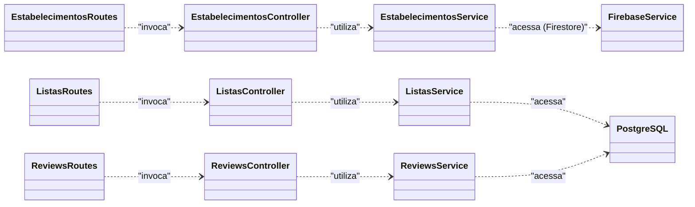

# Visão Geral do Projeto

Este projeto é o backend do Place, um serviço que permite aos usuários avaliar estabelecimentos gastronômicos, além da possibilidade do usuário criar uma espece de "Playlist" 
de estabelecimentos. É uma aplicação Node.js construída com Express.js, usando o Firestore e PostgreSQL como banco de dados.

## Tecnologias Utilizadas

*   **Node.js**: Ambiente de execução JavaScript server-side.
*   **Express.js**: Framework para construção de APIs web em Node.js.
*   **PostgreSQL**: Banco de dados relacional para armazenar dados de listas e reviews.
*   **Firestore**: Banco de dados NoSQL para armazenar dados de estabelecimentos.
*   **Firebase Admin SDK**: Para autenticação de usuários e acesso ao Firestore.
*   **Swagger**: Para documentação da API.

## Estrutura do Banco de Dados

### PostgreSQL

O banco de dados PostgreSQL é utilizado para armazenar informações sobre as listas de estabelecimentos e as reviews dos usuários.

**Tabela `listas`**

| Coluna | Tipo | Descrição |
| --- | --- | --- |
| `id` | `SERIAL PRIMARY KEY` | Identificador único da lista |
| `nome` | `VARCHAR(255)` | Nome da lista |
| `usuario_id` | `VARCHAR(255)` | ID do usuário que criou a lista |
| `publica` | `BOOLEAN` | Indica se a lista é pública ou não |

**Tabela `lista_estabelecimentos`**

| Coluna | Tipo | Descrição |
| --- | --- | --- |
| `lista_id` | `INTEGER` | ID da lista (chave estrangeira para `listas.id`) |
| `estabelecimento_id` | `VARCHAR(255)` | ID do estabelecimento (chave estrangeeira para `estabelecimentos.id` no Firestore) |

**Tabela `reviews`**

| Coluna | Tipo | Descrição |
| --- | --- | --- |
| `id` | `SERIAL PRIMARY KEY` | Identificador único da review |
| `usuario_id` | `VARCHAR(255)` | ID do usuário que criou a review |
| `estabelecimento_id` | `VARCHAR(255)` | ID do estabelecimento (chave estrangeira para `estabelecimentos.id` no Firestore) |
| `nota` | `INTEGER` | Nota da review (de 1 a 5) |
| `comentario` | `TEXT` | Comentário da review |
| `data` | `TIMESTAMP` | Data e hora da criação da review |

### Firestore

O Firestore é utilizado para armazenar informações sobre os estabelecimentos gastronômicos.

**Coleção `estabelecimentos`**

Cada documento na coleção `estabelecimentos` representa um estabelecimento e possui a seguinte estrutura:

```json
{
  "nome": "Nome do Estabelecimento",
  "endereco": "Endereço do Estabelecimento",
  "subcategoriaId": "ID da Subcategoria",
  "rating": 4.5,
  "total_avaliacoes": 100
}
```

## Endpoints da API

A API do Place possui os seguintes endpoints:

### Estabelecimentos

*   `GET /estabelecimentos`: Retorna uma lista de todos os estabelecimentos.
*   `GET /estabelecimentos/top10/:subcategoriaId`: Retorna o top 10 estabelecimentos de uma determinada subcategoria.

### Listas

*   `GET /listas`: Retorna as listas do usuário logado e as listas públicas.
*   `POST /listas`: Cria uma nova lista.

**Corpo da Requisição (POST /listas)**

```json
{
  "nome": "Nome da Lista",
  "usuarioId": "ID do Usuário",
  "estabelecimentos": ["ID do Estabelecimento 1", "ID do Estabelecimento 2"]
}
```

### Reviews

*   `GET /reviews/:estabelecimentoId`: Retorna as reviews de um estabelecimento.
*   `POST /reviews`: Cria uma nova review.

**Corpo da Requisição (POST /reviews)**

```json
{
  "usuarioId": "ID do Usuário",
  "estabelecimentoId": "ID do Estabelecimento",
  "nota": 5,
  "comentario": "Ótimo lugar!"
}
```

## Instruções de Instalação e Execução

1.  Clone o repositório:

```bash
git clone https://github.com/seu-usuario/place-backend.git
```

2.  Instale as dependências:

```bash
npm install
```

3.  Configure as variáveis de ambiente. Crie um arquivo `.env` na raiz do projeto com as seguintes variáveis:

```
PORT=3000
```

4.  Configure a chave de serviço do Firebase. Coloque o arquivo `serviceAccountKey.json` na pasta `Keys`.

5.  Inicie o servidor:

```bash
npm start
```

O servidor estará rodando em `http://localhost:3000` e a documentação da API estará disponível em `http://localhost:3000/api-docs`.

## Arquitetura Detalhada da Aplicação

A arquitetura do backend do Place foi projetada seguindo o padrão de **Arquitetura em Camadas (Layered Architecture)**, uma abordagem robusta e amplamente adotada para a construção de aplicações web e APIs. Este padrão organiza o código em camadas lógicas, cada uma com uma responsabilidade bem definida, promovendo a separação de conceitos (Separation of Concerns), o que resulta em um sistema mais organizado, manutenível e testável.

A implementação específica neste projeto pode ser descrita como uma **Arquitetura de 3 Camadas**, composta por:

1.  **Camada de Apresentação (Presentation Layer)**
2.  **Camada de Serviço / Lógica de Negócio (Service Layer)**
3.  **Camada de Acesso a Dados (Data Access Layer)**

A seguir, cada camada e seus componentes são detalhados.

### 1. Camada de Apresentação (Presentation Layer)

Esta é a camada mais externa da aplicação, responsável por interagir com o cliente (neste caso, o frontend da aplicação ou qualquer outro consumidor da API). Sua principal função é gerenciar as requisições HTTP, processar as rotas e orquestrar a resposta.

**Componentes:**

*   **`app.js`**: O arquivo de entrada principal da aplicação. Ele inicializa o servidor Express, configura middlewares essenciais (como o `express.json()` para parsear o corpo das requisições) e, crucialmente, carrega e delega as rotas para os arquivos apropriados na pasta `Routes`.
*   **`Routes/`**: Este diretório contém os módulos que definem os endpoints da API. Cada arquivo é responsável por um domínio específico da aplicação.
    *   **`authRoutes.js`**: Define as rotas relacionadas à autenticação de usuários.
    *   **`estabelecimentosRoutes.js`**: Define as rotas para consultar informações sobre os estabelecimentos, como a listagem geral e o ranking dos mais bem avaliados.
    *   **`listasRoutes.js`**: Define as rotas para o CRUD (Create, Read, Update, Delete) das "playlists" de estabelecimentos.
    *   **`reviewsRoutes.js`**: Define as rotas para o CRUD de avaliações (reviews) dos estabelecimentos.
*   **`Controllers/`**: Os controladores são o elo entre as rotas e a lógica de negócio. Eles recebem a requisição, extraem informações relevantes (parâmetros, corpo, etc.), realizam validações de entrada e invocam os métodos apropriados na camada de serviço. Ao final, formatam a resposta (seja de sucesso ou de erro) e a enviam de volta ao cliente.
    *   **`estabelecimentosController.js`**: Orquestra as ações para buscar e listar estabelecimentos, chamando o `estabelecimentosService`.
    *   **`listasController.js`**: Gerencia o fluxo das requisições para criar, buscar, atualizar e deletar listas, utilizando o `listasService`.
    *   **`reviewsController.js`**: Controla as operações relacionadas às avaliações, como a criação de uma nova review, e chama o `reviewsService`.
*   **`Middlewares/`**: Contém funções que podem interceptar e processar uma requisição antes que ela chegue ao seu controlador final.
    *   **`authMiddleware.js`**: Um exemplo de middleware que pode ser usado para proteger rotas, verificando se o usuário está autenticado (por exemplo, validando um token JWT) antes de permitir o prosseguimento da requisição.

### 2. Camada de Serviço / Lógica de Negócio (Service Layer)

Esta camada é considerada o "cérebro" da aplicação. Ela encapsula todas as regras de negócio e a lógica de domínio do Place. Os serviços são agnósticos em relação à forma como os dados são apresentados ou de onde vêm as requisições; eles simplesmente executam as tarefas para as quais foram designados.

**Observação Arquitetural Importante:** Na presente arquitetura, a Camada de Serviço também acumula a responsabilidade da **Camada de Acesso a Dados**. Isso significa que os próprios arquivos de serviço contêm o código para interagir diretamente com os bancos de dados (PostgreSQL e Firestore). Esta foi uma decisão de design pragmática para manter a simplicidade em um projeto de escopo definido, evitando uma camada de abstração adicional (como um ORM ou o Padrão Repository).

**Componentes:**

*   **`Services/`**: Este diretório abriga os módulos que implementam a lógica de negócio.
    *   **`estabelecimentosService.js`**: Contém a lógica para buscar informações de estabelecimentos diretamente do **Firestore**. Inclui funções para listar todos os estabelecimentos ou para calcular e retornar o top 10 com base nas avaliações.
    *   **`listasService.js`**: Implementa as regras de negócio para as listas. Ele contém o código que executa as queries SQL no banco **PostgreSQL** para criar uma nova lista, adicionar estabelecimentos a ela, buscar listas de um usuário, etc.
    *   **`reviewsService.js`**: Responsável pela lógica das avaliações. Contém as queries SQL para inserir uma nova avaliação no **PostgreSQL** e para calcular o impacto dessa nova nota no rating geral de um estabelecimento (que por sua vez é atualizado no **Firestore**).
    *   **`userService.js`**: Centraliza a lógica relacionada a operações de usuário, como a criação ou busca de informações de usuários, interagindo com os serviços de autenticação do Firebase.
    *   **`firebaseService.js`**: Um serviço de infraestrutura que encapsula a inicialização e configuração do Firebase Admin SDK, fornecendo uma instância pronta do Firestore para os outros serviços utilizarem.

### 3. Camada de Acesso a Dados (Data Access Layer)

Conforme mencionado, esta camada não possui uma separação física em diretórios próprios, mas suas responsabilidades são executadas por componentes específicos e dentro da camada de serviço. Sua função é ser a única parte do sistema que sabe como se comunicar com as fontes de dados.

**Componentes:**

*   **`db.js`**: Este arquivo é um componente central da camada de acesso a dados para o PostgreSQL. Ele é responsável por configurar e exportar o "pool" de conexões com o banco de dados PostgreSQL, permitindo que os serviços executem queries de forma eficiente.
*   **Código de Query (dentro dos Serviços)**: As queries SQL (`SELECT`, `INSERT`, etc.) e as chamadas de método do Firestore (`db.collection(...)`, `.get()`, `.set()`) que estão dentro dos arquivos de serviço são a implementação prática desta camada.
*   **`Keys/`**: Este diretório armazena as chaves de acesso necessárias para se conectar a serviços externos, como o `serviceAccountKey.json` para o Firebase. É um componente de infraestrutura essencial para que a camada de dados possa se autenticar e operar.

### Fluxo de uma Requisição (Exemplo: `POST /listas`)

Para ilustrar como as camadas interagem, o fluxo de uma requisição para criar uma nova lista seria:

1.  **Cliente -> Camada de Apresentação**: O cliente envia uma requisição `POST` para o endpoint `/listas` com o nome da lista e os estabelecimentos no corpo da requisição.
2.  **Roteamento (`app.js` -> `Routes`)**: O servidor Express, em `app.js`, passa a requisição para o `listasRoutes.js`.
3.  **Invocação do Controller (`Routes` -> `Controllers`)**: O `listasRoutes.js` identifica a rota e invoca a função correspondente no `listasController.js`.
4.  **Delegação para o Serviço (`Controllers` -> `Services`)**: O `listasController` valida os dados recebidos e chama o método `criarLista` no `listasService.js`, passando os dados necessários.
5.  **Execução da Lógica (`Services` -> `Data Access`)**: O `listasService` executa as regras de negócio e, em seguida, utiliza o pool de conexão de `db.js` para executar uma query `INSERT` na tabela `listas` do PostgreSQL.
6.  **Retorno**: O resultado da operação no banco de dados retorna para o serviço, que o repassa ao controlador. O controlador, por sua vez, formula uma resposta HTTP 201 (Created) com os dados da nova lista e a envia de volta ao cliente, completando o ciclo.

## Diagrama de Classes e Relacionamentos

A Figura 1 apresenta o diagrama de classes e relacionamentos da aplicação, ilustrando a interação entre os principais componentes do sistema, como os controladores, serviços e as fontes de dados.


**Figura 1** - Diagrama de Classes e Relacionamentos do Backend

**Fonte:** Elaborado pelo autor (2025).